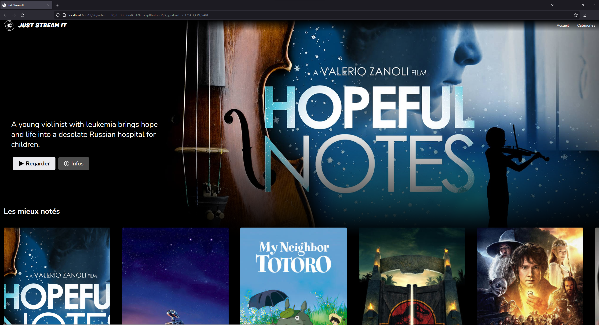

# OpenClassroom | Python | Project #6

## Goal

Create a front-end for a streaming application, base on an existing django REST API.

## v1 - Done

Frontend:

- 1 hero section displayed
- 4 categories displayed ( 1 for top rated movies + 3 of any categories)
- Movie details displayed in a modal window
- Each category fetches more movies from backend if needed
- Responsive from 320px-wide screens

Backend:

- Added a few "top rated" movies in DB and replaced some covers links by bigger ones :)

# v2

- [ ] API class
- [ ] Mocks
- [ ] Controller refactor
- [ ] Category refactor
- [ ] Responsivity improvements

